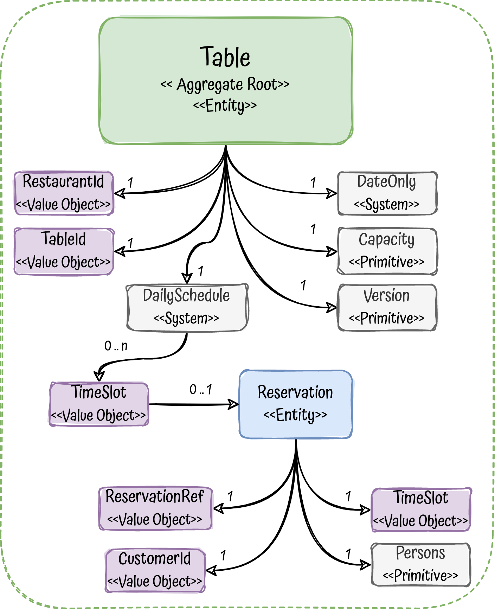

# Table reservation microservice with FSharp

## In progress

!!IN PROGRESS!!

Missing:  outbox pattern, domain events with kafka

## Description

This project is an exercise to practice and see how it fits Domain-Driven Design, Hexagonal Architecture, Functional programming and TDD in F# and dotnet ecosystem.

In addition to that, it brings a full tested and production ready microservice (I hope) that could be used as a blueprint to develop services in this amazing FP language.

Keywords: `DDD`, `microservice`, `FSharp`, `Giraffe`, `Hexagonal-Architecture`, `SOLID`, `Domain-Driven Design`, `functional-programming`,
`Testing`, `Event-Driven Architecture`, `Domain-Events`, `Kafka`, `PostgreSQL`, `Transactional-outbox`, `optimistic-locking`

**NOTE:** I apologise in advance, I am a beginner in FSharp with a functional background in some langs (kotlin, scala, haskell) and development experience in JVM environments.

## The problem to solve

To drive all the project, we need a problem to solve, in this case we will need to create a Restaurant Reservation System.

The system should **let customers** to reserve a table in a restaurant:

- The customer should be able to see the available tables in a restaurant for a given date.
- The customer will choose an available timeslot to make a reservation
- Number of people should fit in the table
- If the reservation is successful, the customer will get a reservation code/ref
- The solution should cover only the Back-end part, no UI at all
- The communication protocol will be REST
- We will need to inform other systems when a reservation is done
- Custom searching, restaurants management or other concerns would be handled by other bounded contexts, this one is about reservations.

## Endpoints

- Get available tables in a restaurant for a given date:
```
GET /tables/available?restaurant-id=530a3998-81ee-4112-8080-54332f4025ee&date=2022-10-11
```
Response:
```json
[
  {
    "tableId": "6de09dfb-1bd5-4263-af68-aa60e54968d4",
    "capacity": 4,
    "availableSlots": ["12:00", "21:00"]
  }
]
```

- Reserve a table:
```
POST /tables/6de09dfb-1bd5-4263-af68-aa60e54968d4/reservations 
```
Body:
```json
{
  "date":"2022-10-11", 
  "persons": 3, 
  "customerId": "27cc6b6e-5761-4ba2-b523-63630d2935ab", 
  "timeSlot": "21:00" 
}
```
Response:
```json
{
  "ref":"x342", 
  "tableId":"6de09dfb-1bd5-4263-af68-aa60e54968d4"
}
```

### Table Aggregate

To ensure the integrity annd consistency of the different invariants, the aggregate will be a table of a restaurant, partitioned by day.

<p align="center">
  
</p>

[Aggregate code](./src/Reservation/Domain.Model.fs#L39)
